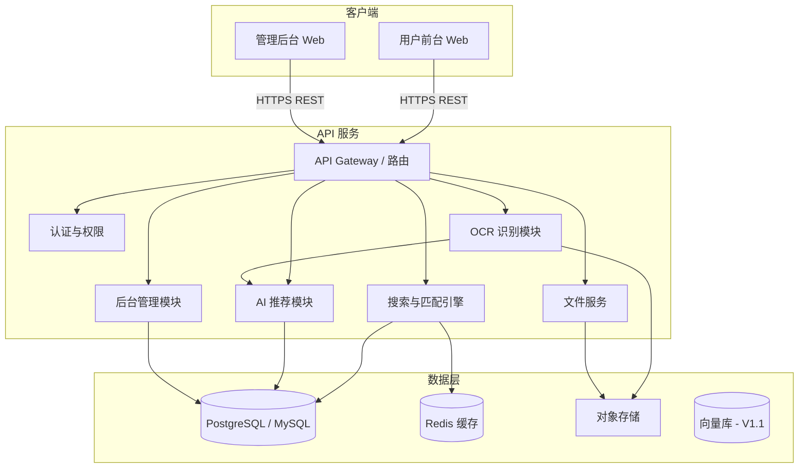

# 系统架构与职责划分

## 1. 总体架构



## 2. 前后端分离原则

| 原则 | 说明 |
|------|------|
| 前台只调 API | 用户前台、管理后台均通过 HTTP API 与后端通信，不直连数据库 |
| 业务逻辑在后端 | 匹配规则、置信度计算、OCR 后处理、Excel 解析均在 API 服务完成 |
| 状态无会话依赖 | 采购清单可用 `user_id` 或匿名 `session_id`；前台不存业务状态 |
| 统一错误格式 | API 返回统一 JSON 结构：`{ code, message, data }` |
| 文件经 API 中转 | 图片、Excel 上传走 API，存储至对象存储，返回 `file_id` / `url` |

## 3. API 服务职责

### 3.1 核心模块

| 模块 | 职责 | 对应 PRD |
|------|------|----------|
| 配件服务 | 配件 CRUD、详情、分类、别名 | §11.1, §12.1 |
| 设备服务 | 整机型号、设备类型、发动机关联 | §11.2, §12.3 |
| 关系服务 | 整机-配件适配、替代件、发动机-配件 | §11.3–11.5 |
| 搜索服务 | 文本搜索、编号精确匹配、意图识别 | §8.2, §10.5 |
| 图片服务 | 上传、OCR、铭牌字段提取 | §8.3, §8.4 |
| 批量服务 | Excel 模板、解析、逐行匹配 | §8.6 |
| 清单服务 | 采购清单增删改、合并、意向单 | §8.9 |
| 工单服务 | 人工查询创建、状态流转、回填 | §8.10, §11.9 |
| AI 服务 | 语义理解、候选排序、置信度、证据 | §10.4, §10.6 |
| 日志服务 | 查询记录、匹配证据、指标统计 | §12.8, §12.9, §15 |

### 3.2 技术建议

- **语言/框架**：Python FastAPI 或 Node.js NestJS（二选一，团队熟悉为准）
- **数据库**：PostgreSQL（JSON 字段存 `specs`、`extracted_info`）
- **缓存**：Redis（热门配件、编号索引）
- **对象存储**：MinIO / S3 兼容（图片、Excel、附件）
- **OCR**：第三方 API（如 Azure/Google/百度）或 PaddleOCR 自部署
- **AI 大模型**：OpenAI 兼容接口，用于意图理解与候选排序
- **向量库（V1.1）**：pgvector / Qdrant，用于 RAG

## 4. 用户前台职责

| 模块 | 页面 | 职责 |
|------|------|------|
| 首页 | 配件查询首页 | 搜索框、上传入口、分类导航、语言切换 |
| 搜索 | 文本搜索结果页 | 展示候选列表、置信度、匹配原因 |
| 图片 | 图片识别页 / 铭牌结果页 | 上传 UI、识别结果展示、补充信息 |
| 批量 | Excel 上传页 / 批量结果页 | 模板下载、上传、逐行状态展示 |
| 详情 | 配件详情页 | 完整配件信息、替代件、加入清单 |
| 清单 | 采购清单页 | 数量编辑、合计、提交意向 |
| 人工 | 人工查询表单页 | 表单、附件、提交工单 |

**不负责**：匹配算法、OCR 处理、数据持久化逻辑。

## 5. 管理后台职责

| 模块 | 页面 | 职责 |
|------|------|------|
| 配件 | 配件管理 | 增删改查、上下架、图片 |
| 设备 | 设备管理 | 整机型号维护 |
| 关系 | 适配关系 / 替代件 | 关系表维护 |
| 工单 | 工单管理 | 查看、处理、回填配件 |
| 日志 | 查询记录 | AI 匹配日志、证据查看 |

**V1.1 扩展**：知识库管理、AI 结果审核、数据看板。

## 6. API 接口分组（概要）

```
/api/v1
├── /parts              # 配件查询与详情
├── /search             # 文本/综合搜索
├── /machines           # 设备型号
├── /images             # 图片上传与 OCR
├── /batch              # Excel 批量
├── /cart               # 采购清单
├── /tickets            # 人工工单
├── /admin
│   ├── /parts          # 配件管理
│   ├── /machines       # 设备管理
│   ├── /relations      # 适配关系
│   ├── /cross-refs     # 替代件
│   ├── /tickets        # 工单处理
│   └── /query-logs     # 查询日志
└── /i18n               # 语言与文案
```

## 7. 数据模型（MVP 核心表）

来自 PRD §12，MVP 必须建表：

- `part` — 配件主表
- `part_image` — 配件图片
- `machine` — 设备表
- `machine_part_relation` — 整机配件关系
- `part_cross_reference` — 替代件关系
- `part_alias` — 配件别名（多语言搜索）
- `cart_item` — 采购清单
- `manual_ticket` — 人工工单（扩展 PRD 字段）
- `part_query_log` — 查询记录
- `ai_match_evidence` — 匹配证据

**V1.1 新增**：`engine_part_relation`、RAG 文档表、向量索引。

## 8. 非功能需求映射

| 需求 | 负责方 |
|------|--------|
| 文本查询 ≤ 3s | API 搜索服务 + DB 索引 |
| 编号精确匹配 ≤ 1s | API + Redis 缓存 |
| OCR ≤ 10s | API 异步任务或同步超时控制 |
| 文件校验 | API 文件服务 |
| 后台权限 | API 认证中间件 + Admin 路由守卫 |
| 联系方式脱敏 | API 返回时脱敏 |